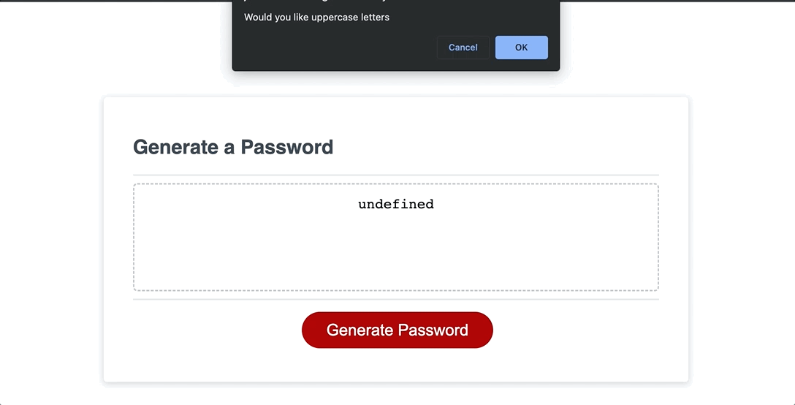

# java-password-generator
A password generator

# Description
This project created a password word generator that gives the user options on how the password will be made.

# Completed Task
- Created prompts for selection of password criteria
- Prompts consited of length, numbers, special characters, and both upper and lower case letters
- Validated the inputs for length of password and at least one character type selected
- Password is generated with selected charactor type and displayed on the page

# Links
[Code Repository](https://github.com/Justin-Brueske/java-password-generator)

[Deployed Site](https://justin-brueske.github.io/java-password-generator/)

# Usage 
Can be viewed in desktop or mobile web browser.
